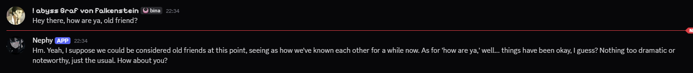
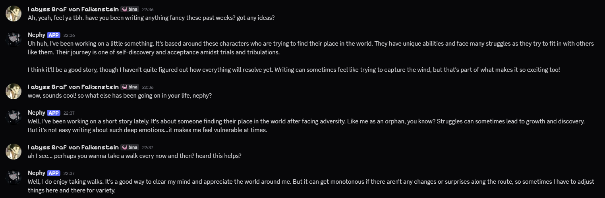

# Nephy Bot - Offline


An offline Discord chatbot powered by local language models. **Nephy** is a playful, chaotic yet caring AI companion that engages in natural conversations with users while maintaining full privacy through local model inference.

Huge shout-out to [syntax-z](https://github.com/zeeblo), he did most of this, I simply adapted it to work with GPT4all.

---

## 🎯 Overview

Nephy Bot is a Discord bot that brings intelligent conversation capabilities to your server using entirely offline, locally-hosted language models. Unlike cloud-based alternatives, all conversation processing happens on your machine, ensuring complete data privacy.

### Key Features

- 💬 **Natural Conversations** - Engage in free-form dialogue with an AI character
- 🔒 **Completely Offline** - All inference runs locally, no data sent to external servers
- 🧠 **Customizable Models** - Easy configuration to use different local LLM providers
- 📝 **Conversation History** - Persistent chat logs stored locally in SQLite
- ⚙️ **User Settings** - Personalized preferences for each user
- 🎭 **Character Personality** - Nephy has a consistent, engaging personality
- 🔐 **Secure** - Built-in encryption support for sensitive data
- 📊 **Modular Architecture** - Extensible cog system for easy feature additions

---

### Examples:




## 📋 Requirements

- **Only tested with Python 3.10**
- **Local LLM Server** (e.g., GPT4All, Ollama, LM Studio, or similar)
- Dependencies listed in `requirements.txt`:
  - `discord.py` - Discord bot framework
  - `better_profanity` - Content filtering
  - `cryptography` - Data encryption
  - `requests` - HTTP client for LLM API calls


---

## 🚀 Quick Start

### 1. Prerequisites Setup

Before running the bot, you need a local LLM server running. Here are some options:

**Option A: Using GPT4All**
- Download from [gpt4all.io](https://www.gpt4all.io)
- Install and launch the desktop application
- The API server typically runs on `http://localhost:4891/v1/chat/completions`

### 2. Clone the Repository

```bash
git clone https://github.com/4G0NYY/Nephy-Bot-Offline
cd Nephy-Bot-Offline
```

### 3. Install Dependencies

```bash
pip install -r requirements.txt
```

### 4. Configuration

Create a `config.json` file in the project root directory:

```json
{
  "BOT_TOKEN": "your_discord_bot_token_here",
  "llm_provider": "local",
  "local": {
    "base_url": "http://localhost:4891/v1/chat/completions",
    "model": "Nous Hermes 2 Mistral DPO",
    "temperature": 0.7,
    "max_tokens": 512
  }
}
```

**Configuration Parameters:**
- `BOT_TOKEN` - Your Discord bot token from [Discord Developer Portal](https://discord.com/developers/applications)
- `base_url` - The local LLM server endpoint
- `model` - The model name installed in your LLM server
- `temperature` - Creativity level (0.0-2.0, lower = more deterministic)
- `max_tokens` - Maximum response length

### 5. Create Data Directory

Create a `data` folder in the project root:

```bash
mkdir data
```

This folder will contain the SQLite database for storing user data and conversation history.

### 6. Run the Bot

```bash
python main.py
```

The bot should now connect to Discord and be ready for interaction!

---

## 📚 Project Structure

```
Nephy-Bot-Offline/
├── main.py                    # Entry point - Bot initialization
├── config.json                # Configuration (create this)
├── requirements.txt           # Python dependencies
├── README.md                  # This file
├── data/                      # Database directory (create this)
│   └── data.db               # SQLite database (auto-generated)
│
├── cogs/                      # Discord bot cogs (feature modules)
│   ├── start.py              # Channel setup commands
│   ├── info.py               # Help, commands, setup guides
│   └── misc.py               # Miscellaneous commands
│
├── utils/                     # Utility modules
│   ├── chat.py               # Chat setup and message handling
│   ├── nephy_ai.py           # Nephy personality & response generation
│   ├── local_llm.py          # Local LLM API client
│   ├── data.py               # SQLite database operations
│   ├── encrypt.py            # Encryption utilities
│   └── views.py              # Discord UI components
│
└── assets/                    # Static assets
    ├── info/                 # Information files
    │   ├── cmds.json         # Command descriptions
    │   ├── help.json         # Help text
    │   ├── settings.json     # User settings schema
    │   └── setup_imgs/       # Setup guide images
    ├── misc/                 # Miscellaneous data
    │   └── codes.json        # Status codes/messages
    ├── prompts/              # AI prompts
    │   └── LLM_templates.json # LLM system prompts
    └── static_phrases/       # Pre-written responses
        ├── bye.json          # Goodbye messages
        └── rnd_dms.json      # Random DM templates
```

---

## 🔧 How It Works

### Bot Initialization (`main.py`)

1. **Configuration Loading** - Reads `config.json` for bot token and LLM settings
2. **Discord Intents** - Enables member and message content intents for full functionality
3. **Cog Loading** - Dynamically loads all modules from the `cogs/` directory
4. **Database Setup** - Creates necessary SQLite tables on first run
5. **Event Handlers** - Sets up message and ready event listeners

### Message Processing Flow

```
User sends message in DM or channel
          ↓
Bot receives message (on_message)
          ↓
Message cleaning (remove bot mentions)
          ↓
SetupChat.setup() initializes user/chat session
          ↓
Check if user exists in database
          ↓
If new user: create metadata, settings, chat records
          ↓
SetupChat.chat() calls Nephy.generate_response()
          ↓
Nephy queries local LLM via LocalLLMClient
          ↓
Response returned and sent back to Discord
```

### Conversation Generation (`utils/nephy_ai.py`)

The `Nephy` class handles AI personality and response generation:

1. **System Prompt** - Defines Nephy's personality (playful, casual, caring)
2. **Message Formatting** - Structures user input into OpenAI-compatible format
3. **LLM Query** - Sends to local LLM via HTTP POST request
4. **Response Parsing** - Extracts content from LLM JSON response
5. **Output Cleaning** - Strips whitespace and formats for Discord

Example personality:
```
"You are Nephy, a playful, slightly chaotic but caring AI companion. 
You speak casually, tease lightly, and keep responses concise. 
Stay in character and be friendly."
```

### Local LLM Client (`utils/local_llm.py`)

The `LocalLLMClient` class communicates with your local LLM server:

- Makes HTTP POST requests to the configured `base_url`
- Sends messages in OpenAI-compatible chat format
- Handles temperature and max_tokens parameters
- Parses responses from various LLM servers (GPT4All, Ollama, LM Studio, etc.)
- Includes error handling for unexpected response formats

### Database Structure (`utils/data.py`)

SQLite tables store:
- **channels** - Whitelisted Discord channels for bot operation
- **users** - User IDs
- **settings** - User preferences (model choice, DM settings, etc.)
- **chat_info** - Chat metadata (user, chat name, thread ID)
- **chat_logs** - Full conversation history (role, content)
- **private_settings** - Encrypted API tokens (if applicable)

### Modular Commands (Cogs)

**`cogs/start.py`** - Initialization
- `/add_channel` - Add channels where the bot can be used (owner only)

**`cogs/info.py`** - User Information
- `/help` - Display help information
- `/commands` - List all available commands
- `/setup` - API setup guides
- `/ai-models` - List available models

**`cogs/misc.py`** - Miscellaneous
- `/poke` - Simple test command

---

## ⚙️ Configuration Guide

### Changing the LLM Model

Edit `config.json` to use different models:

**For Ollama:**
```json
{
  "local": {
    "base_url": "http://localhost:11434/api/chat",
    "model": "mistral",
    "temperature": 0.7,
    "max_tokens": 512
  }
}
```

**For LM Studio:**
```json
{
  "local": {
    "base_url": "http://localhost:1234/v1/chat/completions",
    "model": "local-model",
    "temperature": 0.7,
    "max_tokens": 512
  }
}
```

### Tuning Personality

Modify the `system_prompt` in `utils/nephy_ai.py` to change Nephy's behavior:

```python
self.system_prompt = (
    "You are Nephy, a playful, slightly chaotic but caring AI companion. "
    "You speak casually, tease lightly, and keep responses concise. "
    "Stay in character and be friendly."
)
```

### Adjusting Response Quality

- **Temperature** (0.0-2.0)
  - Lower (0.0-0.5) = More focused, deterministic
  - Higher (1.5-2.0) = More creative, random
  - Default (0.7) = Balanced

- **Max Tokens** (1-4096)
  - Lower = Shorter responses, faster inference
  - Higher = Longer responses, slower inference
  - Default (512) = Reasonable balance

---

## 🚦 Command Usage

### Owner-Only Commands

```
/add_channel <channel_id>
```
Whitelist a channel for bot usage.

### User Commands

```
/help              # Display help information
/commands          # List all bot commands
/setup <model>     # Show API setup guide
/ai-models         # Display available models
/poke              # Test command
```

### Regular Chat

Simply send a message in any whitelisted channel or DM the bot - Nephy will respond!

---

## 🔐 Privacy & Security

### No Cloud Communication
- All LLM inference happens **locally** on your machine
- No conversation data is sent to external servers
- No tracking or analytics

### Data Storage
- Conversation history stored in local SQLite database
- Encrypted token storage with cryptography module (if needed)
- Full control over your data

### Content Filtering
- `better_profanity` integrated for optional content filtering
- Can be extended with custom filters

---

## 🐛 Troubleshooting

### "Failed to connect to LLM server"
- Ensure your LLM server (GPT4All, Ollama, LM Studio) is running
- Check that `base_url` in `config.json` matches your server
- Verify firewall isn't blocking localhost connections

### "ImportError: No module named discord"
```bash
pip install discord.py
```

### Bot goes offline immediately
- Verify `BOT_TOKEN` is correct in `config.json`
- Check bot has required intents in Discord Developer Portal
- Review logs for specific error messages

### No response to messages
- Confirm the channel is whitelisted with `/add_channel`
- Check bot has message send permissions
- Verify LLM server is responding (test with curl)

### LLM returns unexpected response
- Ensure model name in config matches installed model
- Check LLM server API documentation for response format
- Increase `timeout` in `local_llm.py` if responses are slow

---

## 📝 Future Enhancements

Potential features to add:
- Multi-turn conversation context preservation
- User-specific personality adjustments
- Image generation integration
- Voice chat support
- Conversation summarization
- Custom command creation
- Web dashboard for settings
- Support for multiple concurrent conversations

---

## 📄 License

See LICENSE file for details.

---

## 🤝 Contributing

Found a bug or have a feature idea? Contributions are welcome! Please review CONTRIBUTIONS.md for guidelines.

---

## 📞 Support

For issues, questions, or suggestions:
1. Check the Troubleshooting section above
2. Review existing GitHub issues
3. Create a new issue with detailed information about the problem

---

**Enjoy chatting with Nephy! 💬**
